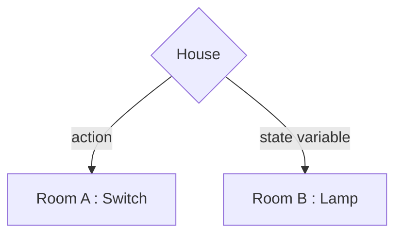
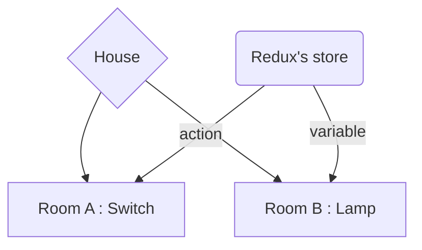

# Redux Illustrated in a React app

Hi! I'm Lossushi. This is a tutorial on **Redux** and a little on **React**. We will see the process of an app and **how** to structure it for best efficiency. In other words, **Why** and **When** should I use redux?

### table of contents
- React
	- [What are we building?](#what-are-we-building)
	- [Why are we building such a weird house?](#why-are-we-building-such-a-weird-house)
	- [Memoization](#memoization)
- Redux and React-Redux
	- [And then comes Redux](#and-then-comes-redux)
	- [Adding Redux and React-Redux](#adding-redux-and-react-redux)
	- [Last tweak for efficiency](#last-tweak-for-efficiency)
- [A few last words](#a-few-last-words)
- [Just show me the full code](#links-to-code)
- [Follow me](#follow-me)

Before getting to Redux, let's code the app in React and analyze how it works.

## What are we building?

A very simple app made of three components. A main one: House, and two nested components: Switch and Lamp.

As some of you may have already guessed, Switch and Lamp will share some changing data (namely turning the light on and off) and since these components are both nested we need to lift the state up to their closest common ancestor, House.

For those who need a reminder, here is the link to the React documentation on [lifting up the state](https://reactjs.org/docs/lifting-state-up.html).
- House : holding the state
	- Switch : receiving the action as props
	- Lamp : receiving the state variable as props

> Note : We will be using React Hooks and its useState() to hold the state in the House component. We could use class components but there is really no need and function components are so much shorter to code.

Let's do that :

Four files : one for each components and a CSS file .

House.js
```javascript
import React, { useState } from "react";
function House() {
  const [onOff, setOnOff] = useState(false);
  return (
    <div>
      <Switch setOnOff={setOnOff} />
      <Lamp onOff={onOff} />
    </div>
  );
}
```
Switch.js
```javascript
function Switch({ setOnOff }) {
  return (
    <button onClick={() => setOnOff((currentState) => !currentState)}>
      On/Off
    </button>
  );
}
```
Lamp.js
```javascript
function Lamp({ onOff }) {
  return <div className={onOff ? "lamp on" : "lamp off"} />;
}
```
style.css
```css
.lamp {
  width: 100px;
  height: 100px;
  border-radius: 50%;
}
.on {
  background: #ff0;
}
.off {
  background: rgba(165, 165, 0, 0.705);
}
```

*Really simple !*
Find this code on codesandbox :[The react only version](https://codesandbox.io/s/redux-illustrated-react-only-version-rgcrs?file=/src/Home.js)

## Why are we building such a weird house?
*One would usually want the switch in the same room as the lamp.*

We want to observe what happens when we click on the Switch's button. Specifically which component is rendered and in what order .

To help with that we can add the following to each component and check our console.

```javascript
console.log("rendering [component's name]");
```

**Reminder** : (and that goes for ```setState()``` in class components as well) When a variable in the state changes react re-renders.

Here is a diagram of our app to help visualize the process :


I click on my button in my Switch component. The 'action' that was passed down as a props sends the change of the state back up to the House component thus House is re-rendered.
Since Switch and Lamp are nested in House they also end up being re-rendered.
The whole app has been re-rendered.

***Now that is not efficient at all!***
Imagine the Switch component is holding some expensive data, it will have to re-render it even though the change of state affects only the holder of the state (House) and where the variable is used (Lamp).

Before wowing you with the efficiency of Redux, I would like to point out that it is possible to avoid Switch from being re-rendered.

## Memoization
*This is not a mistype. Here's the idea :*

Since the props does not change (here our setOnOff function), React can skip rendering the Switch, and reuse the last rendered result. (Only the variable in the state changes which is in both House and Lamp).

Here is the doc on memoization : [React.memo](https://reactjs.org/docs/react-api.html#reactmemo) for function components and [React.PureComponent](https://reactjs.org/docs/react-api.html#reactpurecomponent) for class components.

That's how the new code looks like :
```javascript
const Switch = React.memo(({ setOnOff }) => {
  return (
    <button onClick={() => setOnOff(currentState => !currentState)}>
    On/Off
    </button>
  );
});
```
Code : [The react.memo version](https://codesandbox.io/s/redux-illustrated-memo-version-oe18j?file=/src/Home.js)

Now when the app is first rendered we will see logged :
```
rendering House
rendering Switch 
rendering Lamp
```
then at every click only :
```
rendering House
rendering Lamp
```

*Well that is more efficient than the previous version but what if the expensive data is in House instead of Switch we would still have a slow app.*

## And then comes Redux

***The following is the analogy not to miss !!!***

Before we  get technical, I would like you to imagine the state which is held in House as an electric panel. We have seen this, every time we hit the switch the current (data in our case) goes up to the panel (the state, causing re-render) and down to the lamp.

What if we could take the electric panel out of the House and store it in the shed or the garage, well anywhere outside the House really. Quite literally that is exactly what Redux allows us to do.

Here is the diagram of what our app will look like :

With this architecture in our code, every time we switch on and off, it goes straight to the store then to the lamp. We have cut the middle man thus House will not re-render which also means we do not need to use memoization on Switch anymore.

**That's sounds awesome ! Why haven't we done that from the start ?!**

While it **is awesome**, it is also lengthy to code. Which is why I wanted you to properly understand the mechanics, then **you will know when use Redux**.

## Adding Redux and React-Redux

A little explanation on how to add Redux to your app.
Redux is made of :
- a store
- action(s)
- reducer(s)
- dispatch
- display

*Don't be intimidated by the list it is actually quite easy !*

Think of it this way :
*Here comes another analogy. I love analogies !* 😄

```javascript
let store = 0;			// store : global scope variable
function add(param){		// action : description
  store += param;		// reducer : compute
  return console.log(store);	// display : show result (inside Lamp)
}
add(1);				// dispatch : invoke function (inside Switch)
```
The new files :

Index.js
> First we "initialize" the store at a global scope so that the whole app has access to it.
If I were to use our house analogy we simply need to extend a wire from the electrical panel to any room in the house to have electricity.

```javascript
import { Provider } from "react-redux";
import { createStore } from "redux";
import { reducer } from "./Redux/Reducer";

const store = createStore(reducer);
const rootElement = document.getElementById("root");
ReactDOM.render(
  <Provider store={store}>
    <Home />
  </Provider>,
  rootElement
);
```
ActionType.js
> It not a necessity to have an actionType.js file but saving your action's names in contant variables is prone to less bugs or mistakes.
```javascript
export const TOGGLE = "TOGGLE";
```

Action.js
> Like I said above this is the description of the action. It is a simple javascript function that returns an object.
```javascript
import { TOGGLE } from "../ActionType";

export const setOnOff = () => {
  return {
    type: TOGGLE
  };
};
```
Reducer.js
> Given the action it updates the state. (The computation part). Again this is simple javascript.
```javascript
import { TOGGLE } from "../ActionType";

const initialState = {
  onOff: false,
  user: "Bob"
};
  
export const reducer = (state = initialState, action) => {
  switch (action.type) {
    case TOGGLE:
      return { ...state, onOff: !state.onOff };
    default:
      return state;
  }
};
```

The updated files :

Home.js
> We clean the house from the old wiring.
```javascript
function House() {
console.log("rendering Home");
return (
  <div>
    <Switch />
    <Lamp />
  </div>
  );
}
```
Switch.js
> Dispatch : with the help of the react-redux function connect() actions are mapped to the props. It is react-redux way of passing down the action like we did in the Home.js file : ```<Switch setOnOff={setOnOff} />```
```javascript
import { setOnOff } from "./Redux/Action";
import { connect } from "react-redux";

function Switch({ setOnOff }) {
  console.log("rendering Switch");
  return <button  onClick={setOnOff}>On/Off</button>;
}

export default connect(null, { setOnOff })(Switch);
```
Lamp.js
> Display : basically the same as dispatch for mapping the state to props (```<Lamp onOff={onOff} />```).
```javascript
function Lamp({ onOff, user }) {
  console.log("rendering Lamp");
  return (
    <div>
      <p>{ user } is turning on and off the switch</p>
      <div className={onOff ? "lamp on" : "lamp off"} />
    </div>
  );
}

export default connect(state => state)(Lamp);
```
Code : [The redux version](https://codesandbox.io/s/redux-illustrated-redux-version-l75ld?file=/src/Home.js)

## Last tweak for efficiency

This last part is really when the state has lots of data. Especially data unrelated to the current component. So we need to filter the state. Technically this has nothing to with Redux but this article addresses the issue of efficiency so let' get to it.

*It will be very short since our state has so little data.*

For a more complex example check the [React-Redux basic tutorial](https://react-redux.js.org/introduction/basic-tutorial#basic-tutorial).

The new file :
Selector.js
```javascript
export const getOnOff = store => store.onOff;
```
The updated file :
Lamp.js
```javascript
function Lamp({ onOff, user }) {
  console.log("rendering Lamp");
  return (
    <div>
      <p>{user || "Default user"} is turning on and off the switch</p>
      <div className={onOff ? "lamp on" : "lamp off"} />
    </div>
  );
}

const mapStateToProps = state => {
  console.log("mapping store.state to props");
  return { onOff: getOnOff(state) };
};

export default connect(mapStateToProps)(Lamp);
```
Code : [The redux version with a selector](https://codesandbox.io/s/redux-illustrated-redux-version-with-selector-f9sgw?file=/src/Lamp.js)

Like I said the selector is a simple javascript filter (not to be confused with the method which is probably why it was named selector).
Nonetheless a simple function returning the targeted data.
Which is then mapped to the props in the Lamp component.

>Notice that the data store.state.user is no longer recognized. It was not passed down to the props of Lamp.

## A few last words

As you can see it was a lot to add, so make sure it is worthwhile for your app. Think twice on the structure of your code, the architecture. What will be re-rendered on the change of the state? Is the data in those components expensive thus slowing down my app? Can I use memoization to speed things along?

As a rule of thumb, the bigger the app the more chance the need for Redux, but a developer is an engineer, I think it is better to understand the why and the when.
So be smart in structuring your app.

I hope this article will have helped you in your future projects.
Happy coding !

## Links to Code

- [The react only version](https://codesandbox.io/s/redux-illustrated-react-only-version-rgcrs?file=/src/Home.js)
- [The react.memo version](https://codesandbox.io/s/redux-illustrated-memo-version-oe18j?file=/src/Home.js)
- [The redux version](https://codesandbox.io/s/redux-illustrated-redux-version-l75ld?file=/src/Home.js)
- [The redux version with a selector](https://codesandbox.io/s/redux-illustrated-redux-version-with-selector-f9sgw?file=/src/Lamp.js)

## Follow me

- [twitter](https://twitter.com/lossushi)
- [github](https://github.com/gitSushi)
- [codepen](https://codepen.io/gitsushi/)
<!--stackedit_data:
eyJwcm9wZXJ0aWVzIjoiZXh0ZW5zaW9uczpcbiAgcHJlc2V0Oi
AnJ1xudGl0bGU6IHJlZHV4IGlsbHVzdHJhdGVkXG5hdXRob3I6
IGxvc3N1c2hpXG50YWdzOiA+LVxuICByZWFjdCxyZWR1eCxyZW
FjdC1yZWR1eCx0dXRvcmlhbCxhcnRpY2xlLHBvc3QsYmxvZyx3
ZWIsd2ViXG4gIGRldmVsb3BtZW50LGZyb250LWVuZFxuZGF0ZT
ogJzIwMjAtMDctMTgnXG4iLCJoaXN0b3J5IjpbMTgwNzM3NTMx
OV19
-->